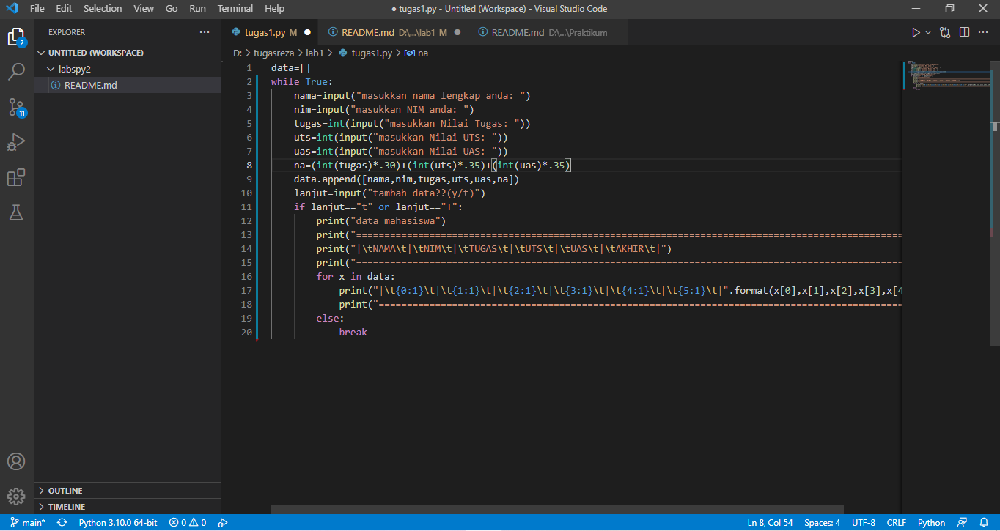
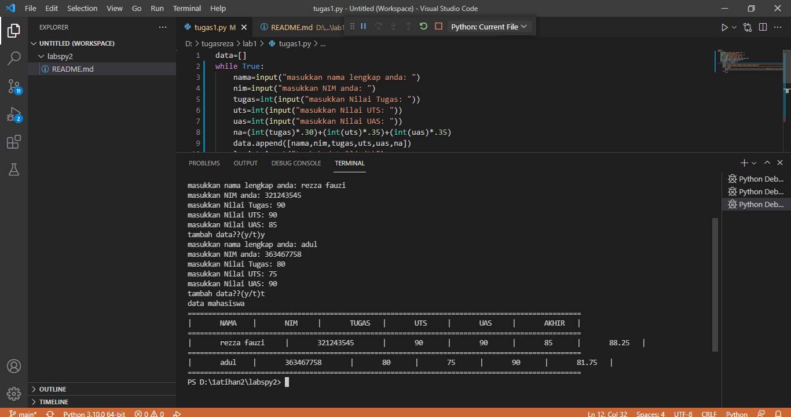
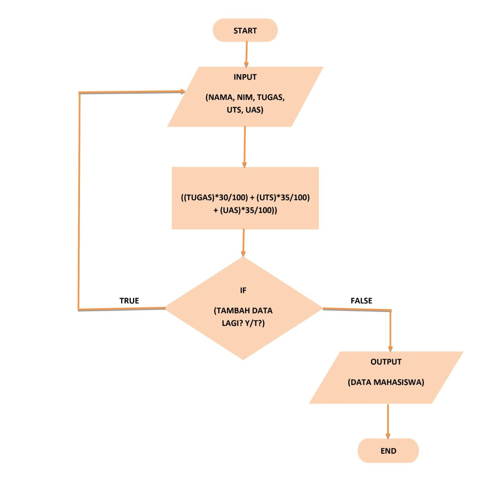

# praktek1
## Rezza Fauzi

Buat program sederhana untuk menambahkan data kedalam sebuah
list dengan rincian sebagai berikut:

• Progam meminta memasukkan data sebanyak-banyaknya (gunakan
perulangan)

• Tampilkan pertanyaan untuk menambah data (y/t?), apabila jawaban
t (Tidak), maka program akan menampilkan daftar datanya. • Nilai Akhir diambil dari perhitungan 3 komponen nilai (tugas: 30%,
uts: 35%, uas: 35%)

• Buat flowchart dan penjelasan programnya pada README.md.

berikut program dan hasil outputnya:

    data=[]
    while True:
        nama=input("masukkan nama lengkap anda: ")
        nim=input("masukkan NIM anda: ")
        tugas=int(input("masukkan Nilai Tugas: "))
        uts=int(input("masukkan Nilai UTS: "))
        uas=int(input("masukkan Nilai UAS: "))
        na=(int(tugas)*.30)+(int(uts)*.35)+(int(uas)*.35)
        data.append([nama,nim,tugas,uts,uas,na])
        lanjut=input("tambah data??(y/t)")
        if lanjut=="t" or lanjut=="T":
            print("data mahasiswa")
            print("=================================================================================================")
            print("|\tNAMA\t|\tNIM\t|\tTUGAS\t|\tUTS\t|\tUAS\t|\tAKHIR\t|")
            print("=================================================================================================")
            for x in data:
                print("|\t{0:1}\t|\t{1:1}\t|\t{2:1}\t|\t{3:1}\t|\t{4:1}\t|\t{5:1}\t|".format(x[0],x[1],x[2],x[3],x[4],x[5]))
                print("=================================================================================================")
            else:
                break

gambar pemrograman :

dan inilah hasil output nya

Dan berikut terakhir flowchartnya

